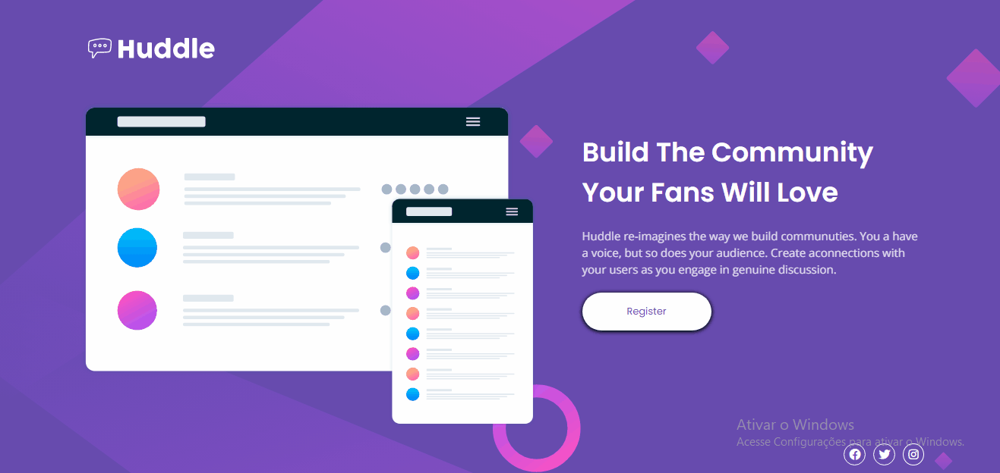

# Quest-Devquest-Front-End mentor

  

### Responsivo-Mobile
  

## Desafios🚀
  Essa foi uma "QUEST" do curso DevQuest usando como base um projeto do Frontend Mentor.
  O projeto deveria ter um layout para desktop com 1440px e uma responsividade para mobile e algumas interações 
  na página, tendo um codigo limpo e semântico.
  
## Dificuldades🚀
  As maiores  dificuldades que eu passei foi de centralizar a imagem de fundo na tela de acordo com a ilustração 
  com o CSS. Mas no final conseguir contruir um site responsivo bem semelhante com o original.
  
## Aprendizado🚀
  Essa foi minha primeira landing page criada sozinho usando meus conhecimento. Entendi a impôrtancia de analisar
  e pensar no projeto antes de sair codando. Aprendi que os minimos detalhes são o que fazem a diferença e mantendo
  tudo bem organizado, com um codigo limpo para entendimento até mesmo para acharmos erros.
 
## Contrução do projeto🚀
-HTML5
-Flex-box 
-style
-reset
-responsivo
-variáveis
-font-awesome
  
## Linguagens usadas
 -CSS3
 -HTML5
  
  Desenvolvido por Lucas felipe.
